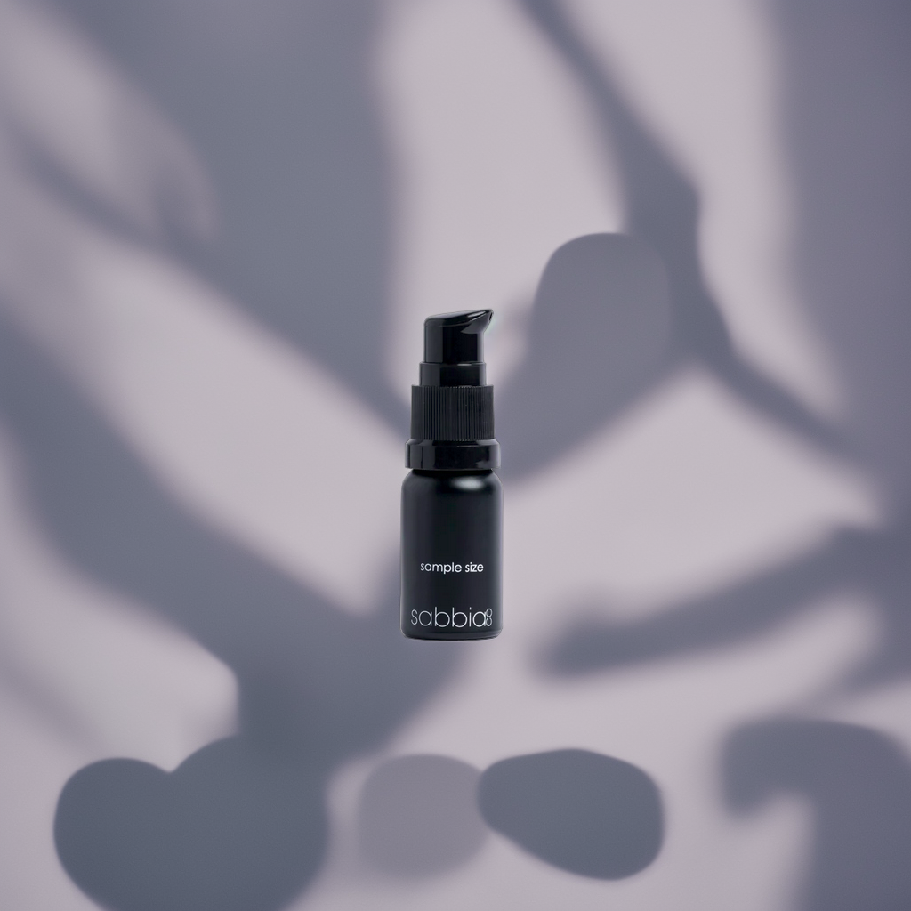

# 🖼️ AI Product Image Generator

This project is a powerful AI-based tool that generates professional product images with custom backgrounds using deep learning and image segmentation. It's especially useful for e-commerce businesses or digital marketers who want to elevate their product images without expensive photo shoots.

## 📌 Features

- ✅ Generates photorealistic backgrounds for product images using Stable Diffusion.
- ✅ Automatically removes background from the original image.
- ✅ Accepts custom prompts to define the new image background.
- ✅ Compatible with Google Colab.
- ✅ Uses Yahoo’s Photo Background Generation model.
- ✅ Supports GPU acceleration (CUDA).

## 🚀 Demo

You can try it directly on Google Colab:  
**[▶ Open in Colab]([https://colab.research.google.com/](https://colab.research.google.com/drive/1wo-vBAJ7WrB-RiDVbyMUNdZi_NPILM_Z#scrollTo=Q64Mj1LYQngy))** 

## 🛠️ Tech Stack

- [🤗 HuggingFace Diffusers](https://github.com/huggingface/diffusers)
- [Torch](https://pytorch.org/)
- [Transformers](https://huggingface.co/transformers/)
- [transparent-background](https://pypi.org/project/transparent-background/)
- PIL (Python Imaging Library)


## ⚙️ Installation

You can run this notebook in Google Colab or locally. To run locally, install dependencies using:

```bash
pip install torch torchvision diffusers transformers transparent-background
```

## ⚙️ Installation

    Model Loading: Loads the pretrained Stable Diffusion model from Yahoo Inc via Hugging Face.

    Image Preprocessing:

        Resizes and pads the image to 1024x1024.

        Removes the original background using transparent-background.

    Image Generation:

        Applies prompts to control background generation.

        Uses ControlNet-style conditioning for better alignment between object and background.

    Output:

        Displays or saves new product images with your desired aesthetic.


## 📝 Usage

In the notebook, use the function:
```bash
generate_image(
    prompt="your background prompt here",
    negative_prompt="bad image, blurry, distorted",
    image_path="path_to_your_image.png",
    num_outputs=1,
    steps=30,
    seed=1234,
    scale=1.0
)
```

## 🖼️ Sample Output


**Before:**


**After:**



## 📄 License

MIT License © 2025 Rado No


Let me know if you'd like help uploading this to your GitHub or editing any specific section, like adding your name or inserting Colab/sample image links. &#8203;:contentReference[oaicite:0]{index=0}&#8203;
